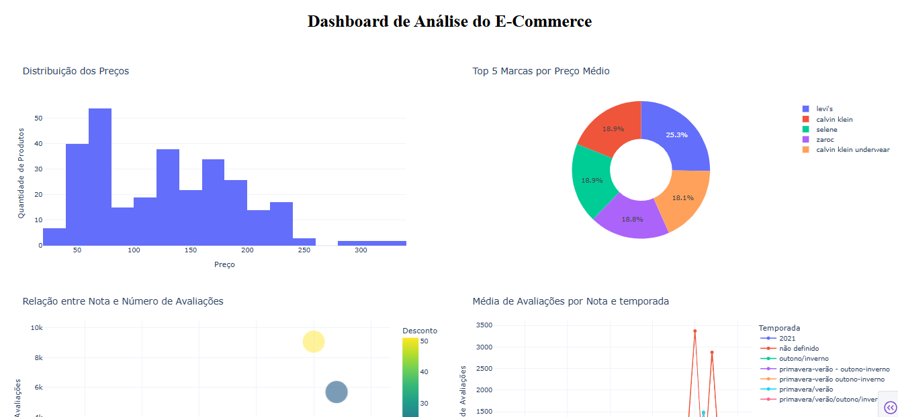
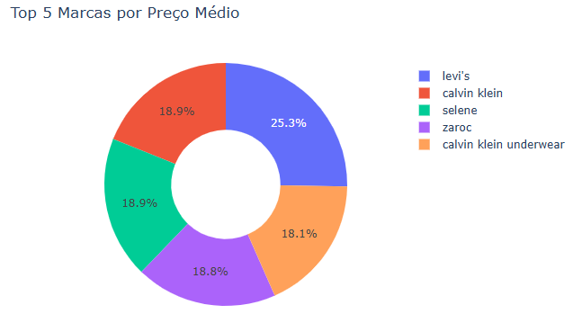
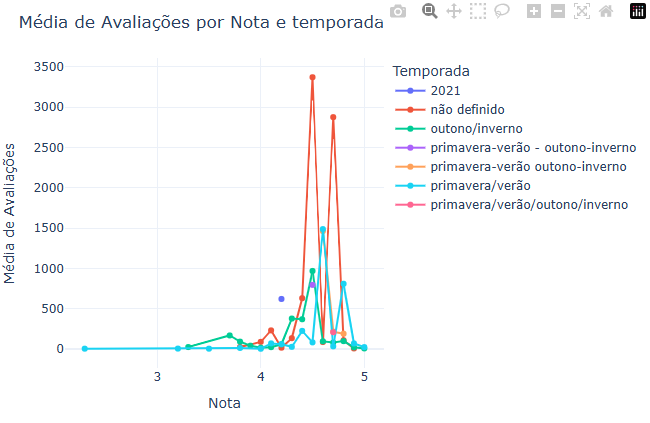
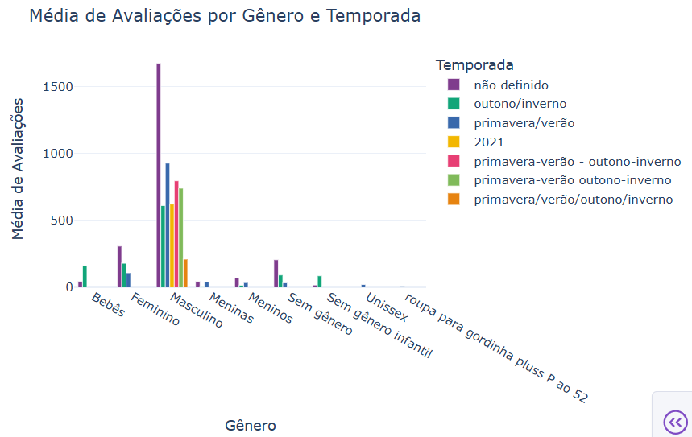

# :bar_chart: Dashboard de E-commerce com Dash

Este projeto foi desenvolvido em Python utilizando Dash e Plotly Express visando criar um dashboard interativo para análise de dados de um e-commerce.
A aplicação permite visualizar indicadores por meio de gráficos dinâmicos, facilitando a interpretação das informações e apoiando a tomada de decisão baseada em dados.
 
## Objetivos
- Praticar análise e visualização de dados com Python;
- Desenvolver um dashboard interativo utilizando Dash;
- Explorar diferentes tipos de gráficos para apresentação dos dados;
- Aplicar boas práticas de organização de projetos utilizando Git e GitHub.

## Tecnologias utilizadas
- Python
- Pandas
- Plotly Express
- Dash
- Git
- GitHub

## Visualizações do Dashboard

### Dashboard


### Gráfico de Pizza
- Gráfico com as cinco marcas de maior destaque conforme a análise realizada.


### Gráfico de Dispersão
- Gráfico de dispersão relacionando notas, quantidade de avaliações e quantidade de produtos vendidos.


### Gráfico de Barras
- Gráfico de barras comparando a média de avaliações por gênero e temporada.


## Estrutura do Projeto
```text
Dashboard-Ecommerce-Dash/
├── assets/
├── app.py
├── ecommerce_estatistica.csv
├── README.md
└── requirements.txt
```

## Como Executar o Projeto
1. Clone este repositório:
```bash
git clone https://github.com/Clau-978/Dashboard-Ecommerce-Dash.git
```
2. Acesse a pasta do projeto:
```bash
cd Dashboard-Ecommerce-Dash
```
3. Instale as dependências:
```bash
pip install -r requirements.txt
```
4. Execute a aplicação:
```bash
python app.py
```
5. Abra o navegador no endereço informado pelo Dash (geralmente `http://127.0.0.1:8050`).

## Aprendizados

Durante o desenvolvimento deste projeto, foi possível praticar:

- Manipulação de dados com Pandas;
- Criação de gráficos interativos com Plotly Express;
- Desenvolvimento de aplicações web com Dash;
- Organização de projetos utilizando Git e GitHub;
- Estruturação de um projeto para composição de portfólio.

## Autora
**Claudiane Custódio**

- GitHub: https://github.com/Clau-978
- LinkedIn: [Claudiane Custódio](https://www.linkedin.com/in/claudiane-custodio)

# :star: Este projeto faz parte do meu portfólio de estudos em Análise de Dados
